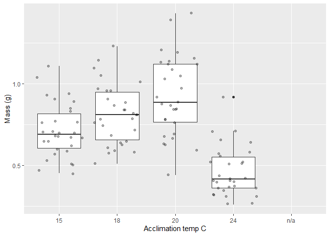
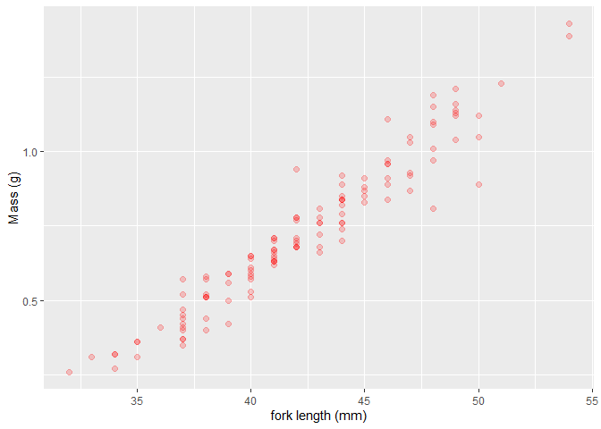
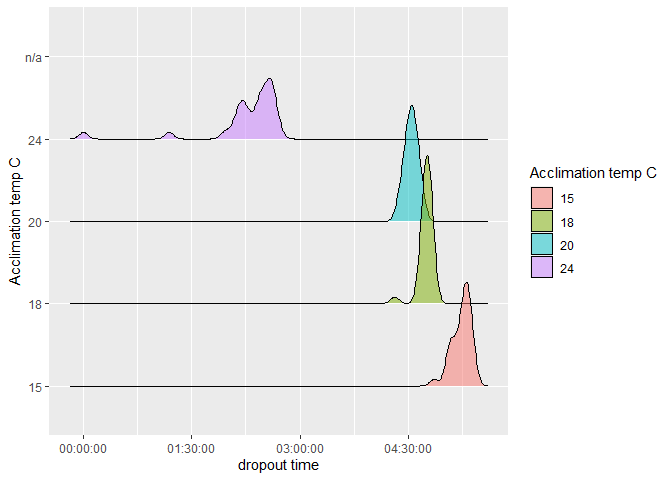
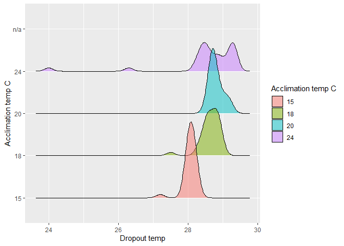
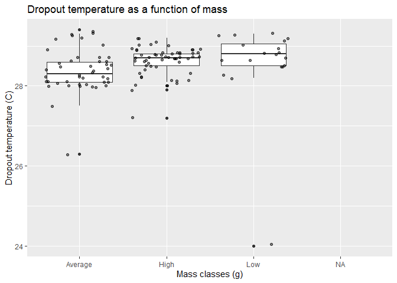

mini data analysis deliverable 2
================
Natalie
16/10/2021

**Housekeeping: load the following packages and dataset**

``` r
library(ggplot2)
library(ggridges)
library(scales)
library(tsibble)
library(tidyverse)
library(rlang)
library(dplyr)

library(readr)
CTmax_swim_Fry <- read_csv("../CTmax_swim_Fry.csv", 
    col_types = cols(`Fish ID` = col_character(),
        `dropout time` = col_time(format = "%H:%M:%S"), 
        `Acclimation temp C` = col_character(), 
        `fork length (mm)` = col_double(),
        `Mass (g)`= col_double(),
        `Dropout temp` = col_double()))
View(CTmax_swim_Fry)
```

# Task 1: Process and summarize data

## 1.1: Reseach Questions

1.  Is body mass influenced by acclimation temperature?

2.  Is there a relationship between fork length and body mass? I.e. can
    I predict that certain length fish will have a certain mass.

3.  Can I find out if acclimation temperature has a more significant
    influence on either dropout time or dropout temperature?

4.  Is there a relationship between body mass and dropout temperature?

## 1.2: Summarizing and Graphing

### Question 1: Is body mass influenced by acclimation temperature?

*Summary*

1.  Computing range, mean, median, and mode for body mass across
    acclimation temperatures will help better summarize the body mass
    data, as opposed to looking at the data unmanipulated.This summary
    helps me answer my question as I’m able to see the differences
    between body mass and their deviation/spread of values within each
    acclimation treatment.

``` r
#Here the mean is computed to look at what the most average fry mass could be expected to be.
CTmax_swim_Fry %>%
  group_by( `Acclimation temp C`) %>%
  summarise(body_mass_mean = mean(`Mass (g)`, na.rm = TRUE))
```

    ## # A tibble: 5 x 2
    ##   `Acclimation temp C` body_mass_mean
    ##   <chr>                         <dbl>
    ## 1 15                            0.715
    ## 2 18                            0.816
    ## 3 20                            0.925
    ## 4 24                            0.464
    ## 5 n/a                         NaN

``` r
#Here the range shows the highest and lowest values for each acclimation treatment.
CTmax_swim_Fry %>%
  group_by( `Acclimation temp C`) %>%
  summarise(body_mass_range = range(`Mass (g)`, na.rm = TRUE))
```

    ## `summarise()` has grouped output by 'Acclimation temp C'. You can override using the `.groups` argument.

    ## # A tibble: 10 x 2
    ## # Groups:   Acclimation temp C [5]
    ##    `Acclimation temp C` body_mass_range
    ##    <chr>                          <dbl>
    ##  1 15                              0.45
    ##  2 15                              1.11
    ##  3 18                              0.51
    ##  4 18                              1.23
    ##  5 20                              0.44
    ##  6 20                              1.43
    ##  7 24                              0.26
    ##  8 24                              0.92
    ##  9 n/a                           Inf   
    ## 10 n/a                          -Inf

``` r
#The median is a little more descriptive than the mean, as the mean will be affected by outliers in the calculation. However, the median is more robust to the outliers in the data that can be present.
CTmax_swim_Fry %>%
  group_by( `Acclimation temp C`) %>%
  summarise(body_mass_median = median(`Mass (g)`, na.rm = TRUE))
```

    ## # A tibble: 5 x 2
    ##   `Acclimation temp C` body_mass_median
    ##   <chr>                           <dbl>
    ## 1 15                              0.69 
    ## 2 18                              0.81 
    ## 3 20                              0.885
    ## 4 24                              0.415
    ## 5 n/a                            NA

``` r
#The standard deviation is measured for each acclimation treatment to see how much variance there is in mass measurements.
CTmax_swim_Fry %>%
  group_by( `Acclimation temp C`) %>%
  summarise(body_mass_sd = sd(`Mass (g)`, na.rm = TRUE))
```

    ## # A tibble: 5 x 2
    ##   `Acclimation temp C` body_mass_sd
    ##   <chr>                       <dbl>
    ## 1 15                          0.165
    ## 2 18                          0.183
    ## 3 20                          0.242
    ## 4 24                          0.153
    ## 5 n/a                        NA

*Graph*

5.  Creating a graph with more than one geom layer can help discern both
    bigger picture visuals along with some detail all in the same
    graphic. While the boxplot allows someone to focus on the general
    distribution of the mass data with each given acclimation treatment,
    the use of geom layer jitter allows the viewer to see the exact
    distribution of the mass data without risk of overlapping data
    points.

This graphic shows general similarity in mass between the 15C, 18C, and
20C acclimation temperatures, and a distinctly smaller mass with the 24C
acclimation temperature, hinting that this higher acclimation
temperature may be adversely affecting growth in this age class.

``` r
ggplot(CTmax_swim_Fry, aes(`Acclimation temp C`, `Mass (g)`))+
  geom_boxplot()+
  geom_jitter(aes(),
            size = 1.5,
            alpha = 0.3)
```

<!-- -->

### Question 2: Is there a relationship between fork length and body mass?

*Summary*

3.  Creating a categorical variable out of the fork length can help
    compare the categorical variable made with body mass (further down).
    If both have variables with the same constraints (based off the
    median and range), a count can be performed comparing how many fish
    scored “Low”, “Average”, or “High” for both fork length and mass.

``` r
(Fry_dropout_length <- CTmax_swim_Fry %>% 
    select(-`dropout time`,-`Mass (g)`, -`Acclimation temp C`,-`Dropout temp`)%>%
    mutate(dropout_length_category = case_when(`fork length (mm)` < 32 ~ "Low",
                                 `fork length (mm)` < 44 ~ "Average",
                                 `fork length (mm)` < 55 ~ "High")))
```

    ## # A tibble: 121 x 3
    ##    `Fish ID` `fork length (mm)` dropout_length_category
    ##    <chr>                  <dbl> <chr>                  
    ##  1 1                         49 High                   
    ##  2 2                         47 High                   
    ##  3 3                         37 Average                
    ##  4 4                         38 Average                
    ##  5 5                         42 Average                
    ##  6 6                         41 Average                
    ##  7 7                         39 Average                
    ##  8 8                         44 High                   
    ##  9 9                         41 Average                
    ## 10 10                        41 Average                
    ## # ... with 111 more rows

*Graph*

7.  The goal of plotting mass and fork length is to visualize the
    measurements of the fish. Here we can see that fish with a larger
    mass do tend to be longer, though there are some outliers, which
    could indicate fish that are either better or worse at competing for
    food than their cohort. Adjusting the alpha is especially important
    in this case because we are reliant on the points for data
    interpretation; as opposed to the boxplots with the overlaid
    points.There is considerable overlap in the middle of the graph,
    where average measurements are. Using point instead of jitter is
    relevant to the data as x-values are numeric and represent the fork
    length, and it’s important to show that some fish had the same fork
    length but different mass.

``` r
ggplot(CTmax_swim_Fry, aes(`fork length (mm)`,`Mass (g)` ))+
  geom_point(colour= "red", alpha=0.2, size=2)
```

<!-- -->

### Question 3: Can I find out if acclimation temperature has a more significant influence on either dropout time or dropout temperature?

*Summary*

1.  I decided to compute range, mean, median, and standard deviation of
    dropout temperature across acclimation treatments. This would be a
    first step into looking at variance in the group. After this I would
    do the same for dropout time; the goal here would be to do some
    basic exploratory summaries and then perfrom an ANOVA, to see if
    there is a difference in significance of variance between
    acclimation groups. For example, if there is significance in the
    variance between acclimation treatments in terms of temperature but
    not time, we can infer that acclimation temperature influences
    temperature more than time.

``` r
#Here the mean is computed to look at what temperature the most fry dropped out at
CTmax_swim_Fry %>%
  group_by( `Acclimation temp C`) %>%
  summarise(dropout_temp_mean = mean(`Dropout temp`, na.rm = TRUE))
```

    ## # A tibble: 5 x 2
    ##   `Acclimation temp C` dropout_temp_mean
    ##   <chr>                            <dbl>
    ## 1 15                                28.1
    ## 2 18                                28.6
    ## 3 20                                28.8
    ## 4 24                                28.6
    ## 5 n/a                              NaN

``` r
#Here the range shows the highest and lowest dropout temperatures for each acclimation treatment.
CTmax_swim_Fry %>%
  group_by( `Acclimation temp C`) %>%
  summarise(dropout_temp_range = range(`Dropout temp`, na.rm = TRUE))
```

    ## `summarise()` has grouped output by 'Acclimation temp C'. You can override using the `.groups` argument.

    ## # A tibble: 10 x 2
    ## # Groups:   Acclimation temp C [5]
    ##    `Acclimation temp C` dropout_temp_range
    ##    <chr>                             <dbl>
    ##  1 15                                 27.2
    ##  2 15                                 28.3
    ##  3 18                                 27.5
    ##  4 18                                 29  
    ##  5 20                                 28.5
    ##  6 20                                 29.2
    ##  7 24                                 24  
    ##  8 24                                 29.4
    ##  9 n/a                               Inf  
    ## 10 n/a                              -Inf

``` r
#The median is a little more descriptive than the mean, as the mean will be affected by outliers in the calculation. However, the median is more robust to the outliers in the data that can be present.
CTmax_swim_Fry %>%
  group_by( `Acclimation temp C`) %>%
  summarise(dropout_temp_median = median(`Dropout temp`, na.rm = TRUE))
```

    ## # A tibble: 5 x 2
    ##   `Acclimation temp C` dropout_temp_median
    ##   <chr>                              <dbl>
    ## 1 15                                  28.1
    ## 2 18                                  28.6
    ## 3 20                                  28.7
    ## 4 24                                  28.8
    ## 5 n/a                                 NA

``` r
#The standard deviation is measured for each acclimation treatment to see how much variance there is in droput temperatures .
CTmax_swim_Fry %>%
  group_by( `Acclimation temp C`) %>%
  summarise(dropout_temp_sd = sd(`Dropout temp`, na.rm = TRUE))
```

    ## # A tibble: 5 x 2
    ##   `Acclimation temp C` dropout_temp_sd
    ##   <chr>                          <dbl>
    ## 1 15                             0.187
    ## 2 18                             0.285
    ## 3 20                             0.189
    ## 4 24                             1.05 
    ## 5 n/a                           NA

*Graph*

7.  Here I’ve decided to use ridge plots for both dropout temperature
    and dropout time. Because there is significant overlap between some
    of the ridges, adjusting alpha transparency is important to be able
    to see all of the data. I decided to do two ridge plots instead of
    boxplots as one of my variables is time, which is better represented
    through a ridge plot. Here we can see that the 24C acclimated fish
    were dropping out at a quicker time, but at a comparable temperature
    range, while the other three acclimation groups had a somewhat
    similar performance when comparing swim time and final temperature.
    This may be because as per CTmax protocols, the temperature of the
    flume or bath is equal to that of the acclimation temperature, so
    the 24C acclimated fish started swimming in 24C water. On the other
    hand, the 15C, 18C, and 20C acclimated fish started at lower
    temperatures and had longer swim times to reach the dropout
    temperatures recorded.

``` r
#This is a ridge plot looking at dropout time in relation to acclimation treatment
(ggplot(CTmax_swim_Fry, aes(`dropout time`, `Acclimation temp C`))+
  ggridges::geom_density_ridges(aes(fill=`Acclimation temp C`), alpha=0.5))
```

    ## Picking joint bandwidth of 220

<!-- -->

``` r
#This is a ridge plot looking at dropout temperature in relation to acclimation treatment
(ggplot(CTmax_swim_Fry, aes(`Dropout temp`, `Acclimation temp C`))+
  ggridges::geom_density_ridges(aes(fill=`Acclimation temp C`), alpha=0.5))
```

    ## Picking joint bandwidth of 0.121

<!-- -->

### Question 4: Is there a relationship between body mass and dropout temperature?

*Summary*

3.  Create a categorical variable sorting dropout mass into low, medium,
    and high. The new categorical variables are informed by the previous
    summaries of the data done in question 1. All unrelated categories
    (length, acclimation temperature, etc.) are removed for ease of
    reading. With this, I can either do a manual comparison of all the
    dropout times or I am now set up to make a box plot to visualize the
    dropout temperatures as a function of body mass.

``` r
(Fry_dropout_mass <- CTmax_swim_Fry %>% 
    select(-`dropout time`,-`fork length (mm)`, -`Acclimation temp C`)%>%
    mutate(dropout_mass_category = case_when(`Mass (g)` < 0.45 ~ "Low",
                                 `Mass (g)` < 0.7146667 ~ "Average",
                                 `Mass (g)` < 1.5 ~ "High")))
```

    ## # A tibble: 121 x 4
    ##    `Fish ID` `Dropout temp` `Mass (g)` dropout_mass_category
    ##    <chr>              <dbl>      <dbl> <chr>                
    ##  1 1                   27.2       1.04 High                 
    ##  2 2                   27.9       0.93 High                 
    ##  3 3                   28         0.57 Average              
    ##  4 4                   28         0.51 Average              
    ##  5 5                   28         0.68 Average              
    ##  6 6                   28         0.65 Average              
    ##  7 7                   28         0.5  Average              
    ##  8 8                   28         0.76 High                 
    ##  9 9                   28         0.62 Average              
    ## 10 10                  28         0.67 Average              
    ## # ... with 111 more rows

*Graph*

5.  Create a graph out of summarized variables that has at least two
    geom layers. By using a box plot with jitter overlaid, we can see a
    simplified visual of the data as well as the individual data points.
    This boxplot shows us that there is considerable overlap with
    dropout temperatures regardless of mass, leaving us to infer that
    mass may not have a role in predicting dropout temperature. Alpha
    transparency here is also adjusted due to crowding of the
    datapoints.

``` r
ggplot(Fry_dropout_mass) + geom_boxplot(aes(x = dropout_mass_category, y = `Dropout temp`)) +
  geom_jitter(aes(x = dropout_mass_category, y = `Dropout temp`), alpha=0.5)+
  labs(y = "Dropout temperature (C)", x = "Mass classes (g)") +
  ggtitle("Dropout temperature as a function of mass")
```

<!-- -->

## 1.3: Reflection of research questions

### Question 1: Is body mass influenced by acclimation temperature?

I feel like I’ve made some headway in terms of addressing if body mass
is influenced by acclimation temperature. So far, I’m interested in this
information because it can give me an idea of how the environment these
fish are in can affect their metabolism and resource partitioning. The
15C, 18C, and 20C fish have very similar mass classes, but the 24C fish
have a noticeably smaller mass. This tells me that most of the nutrients
are being used up for coping with the warm water, while the three other
groups of fish are able to divert extra nutrition towards growth.

I’m not sure if there’s more refining to do, but I would like to do some
sort of extra analysis or model-fitting to see if there is significance
in the preliminary work.

### Question 2: Is there a relationship between fork length and body mass?

I’m having more difficulty with this one, despite it’s simplicity. While
I’m able to find clearer answers through graphing, I ran into trouble
trying to do summaries with it. I think that the creation of categorical
data with both numerical values and comparing how many fish have which
combination of categories can help with some very basic inference.
However, plotting the measurements made it much simpler to see that
while there is variability between mass and fork length, fish with a
longer fork length tended to have a higher mass. In terms of refinement,
I’d like to look at predictability of body mass and fork length given
one of these variables. Is the relationship between fork length and body
mass linear among fry?

### Question 3: Can I find out if acclimation temperature has a more significant influence on either dropout time or dropout temperature?

This is the question I’m having the most trouble with, mainly because
I’m dealing with three different variables, and one of them is of a
different class (time instead of numerical). Especially in terms of
summarizing the data in a way to help further my understanding of the
question. Additionally, I think it would be better if I focused on
dropout temperature instead of time. Due to the nature of the
experiment, where temperature is increased over a fixed time interval
until the last fish drops out, it can quickly be inferred that the fish
who reach the highest temperatures also achieve the longest swim times.
With this, I’d like to adjust the research question to focus on the
relationship between acclimation treatment and dropout
temperature.*Which acclimation temperature yielded fish with the highest
thermal tolerance?*

### Question 4: Is there a relationship between body mass and dropout temperature?

The initial findings surprised me because I hypothesized that smaller
fish would drop out at lower temperatures. This is because they have
less muscle and stored energy, so I thought that they would not be able
to swim as long or be as tolerant to the temperature increases. While I
don’t think there’s extra refinement that can happen to this specific
question, the followup would be to see if fork length can play a role in
dropout temperature. I’m curious about this since a longer fish requires
fewer tail beats to swim a set distance, and since the swim flume was
set to a specific speed, the longer fish did not have to put in as much
work as the smaller fish.

# Task 2: Tidy data

## 2.1: Identifying tidy data

I do believe that my data in its base form is tidy.Each column
represents one variable of the experiemnt (Fish ID, Dropout temperature,
Dropout time, Mass, Fork Length, and Acclimation temperature). Each row
is an observation of data corresponding to one individual fish. As a
fish dropped out of the trial, time and temperature of dropout was
recorded, and then it was measured for mass and fork length.Acclimation
temperature was known beforehand as trials are run with groups of fish
all belonging to the same acclimation treatment. Finally, each cell
contains one value; either the fish’s ID, measurement, performance in
the swimming trial, or acclimation treatment.

## 2.2: Tidying and untidying data

I’m going to firstly untidy the data. In order to do that, I’m going to
pivot wider the Acclimation Temperature column and sort fish mass under
that. This means that each new column representing acclimation
temperature will have the value of mass, and mass will no longer be
contained within its own column, rendering it untidy.This also becomes
untidy as there are large gaps in the table with no values. Because fish
only belonged to one acclimation group, the subsequent acclimation
columns that don’t include the individual fish are left blank.

``` r
(untidy_mass <- CTmax_swim_Fry %>%
    pivot_wider(id_cols = c(`Fish ID`,`dropout time`,`fork length (mm)`, `Dropout temp`), 
                names_from = `Acclimation temp C`,
                values_from = `Mass (g)`))
```

    ## # A tibble: 121 x 9
    ##    `Fish ID` `dropout time` `fork length (mm)` `Dropout temp`  `15`  `18`  `20`
    ##    <chr>     <time>                      <dbl>          <dbl> <dbl> <dbl> <dbl>
    ##  1 1         04:51:26                       49           27.2  1.04    NA    NA
    ##  2 2         05:02:28                       47           27.9  0.93    NA    NA
    ##  3 3         05:04:03                       37           28    0.57    NA    NA
    ##  4 4         05:05:04                       38           28    0.51    NA    NA
    ##  5 5         05:05:38                       42           28    0.68    NA    NA
    ##  6 6         05:05:38                       41           28    0.65    NA    NA
    ##  7 7         05:06:17                       39           28    0.5     NA    NA
    ##  8 8         05:08:50                       44           28    0.76    NA    NA
    ##  9 9         05:10:51                       41           28    0.62    NA    NA
    ## 10 10        05:11:36                       41           28    0.67    NA    NA
    ## # ... with 111 more rows, and 2 more variables: 24 <dbl>, n/a <dbl>

Now, to tidy the data back up again, I’m going to pivot longer and
create two columns; one to encompass the acclimation temperature, and
another for the mass.

``` r
(tidy_mass<- untidy_mass%>%
   pivot_longer(cols=c(-`Fish ID`,-`dropout time`,-`fork length (mm)`, -`Dropout temp`),
                names_to="Acclimation temp C",
                values_to = "Mass (g)"))
```

    ## # A tibble: 605 x 6
    ##    `Fish ID` `dropout time` `fork length (mm)` `Dropout temp` `Acclimation temp~
    ##    <chr>     <time>                      <dbl>          <dbl> <chr>             
    ##  1 1         04:51:26                       49           27.2 15                
    ##  2 1         04:51:26                       49           27.2 18                
    ##  3 1         04:51:26                       49           27.2 20                
    ##  4 1         04:51:26                       49           27.2 24                
    ##  5 1         04:51:26                       49           27.2 n/a               
    ##  6 2         05:02:28                       47           27.9 15                
    ##  7 2         05:02:28                       47           27.9 18                
    ##  8 2         05:02:28                       47           27.9 20                
    ##  9 2         05:02:28                       47           27.9 24                
    ## 10 2         05:02:28                       47           27.9 n/a               
    ## # ... with 595 more rows, and 1 more variable: Mass (g) <dbl>

## 2.3: Research questions to take into Milestone 3

I’ve decided to continue with the questions *Is body mass influenced by
acclimation temperature?*and *Which acclimation temperature yielded fish
with the highest thermal tolerance?*

``` r
#1. In order to further tidy my data, I'm first going to remove the columns that don't have any relevant variables
#2. After this, I know that Fish ID number 323 doesn't have any associated variables, so I can remove that.
#3
#4
(CTmax_swim_Fry_tidy<- CTmax_swim_Fry %>%
   select(`Fish ID`, `Acclimation temp C`, `Mass (g)`, `Dropout temp` ))
```

    ## # A tibble: 121 x 4
    ##    `Fish ID` `Acclimation temp C` `Mass (g)` `Dropout temp`
    ##    <chr>     <chr>                     <dbl>          <dbl>
    ##  1 1         15                         1.04           27.2
    ##  2 2         15                         0.93           27.9
    ##  3 3         15                         0.57           28  
    ##  4 4         15                         0.51           28  
    ##  5 5         15                         0.68           28  
    ##  6 6         15                         0.65           28  
    ##  7 7         15                         0.5            28  
    ##  8 8         15                         0.76           28  
    ##  9 9         15                         0.62           28  
    ## 10 10        15                         0.67           28  
    ## # ... with 111 more rows
